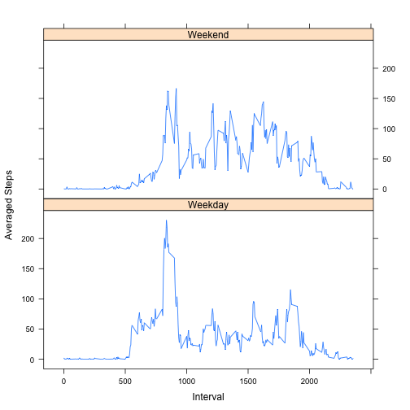

# Reproducible Research: Peer Assessment 1

## Loading and preprocessing the data

```r
if(file.exists("./activity.zip")) {
  unzip("./activity.zip")
}
activity = read.csv("activity.csv",as.is=TRUE)
activity$date <- as.Date(activity$date)
```

## What is mean total number of steps taken per day?

```r
daily <- na.omit(setNames(aggregate(activity$steps,by=list(activity$date),sum),c("Date","Total.steps")))
hist(daily$Total.steps,breaks = max(daily$Total.steps)%/%1000,xlab="Total Steps",main="Histogram of Total Steps Daily",xlim=c(0,25000))
```

 

```r
daily.mean <- mean(daily$Total.steps)
daily.median <- median(daily$Total.steps)
```
#### The mean   total number of steps taken per day is 10766
#### The median total number of steps taken per day is 10765

## What is the average daily activity pattern?

```r
averagedDay <- setNames(aggregate(activity$steps,by=list(activity$interval),mean,na.rm=TRUE),c("Interval","Averaged.steps"))
plot(averagedDay$Interval,averagedDay$Averaged.steps,type="l",xlab="Interval",ylab="Averaged steps",main="Averaged steps across day")
```

 

```r
max.step.interval <-averagedDay[averagedDay$Averaged.steps==max(averagedDay$Averaged.steps),]$Interval
```
#### The 5-minute interval labelled "835" contains the maximum number of steps averaged across all the days in the dataset.

## Imputing missing values

```r
total.missing.values <- sum(is.na(activity$steps))
```
#### There are a total of 2304 missing values in the dataset

The chosen strategy to replace missing values is to substitutue the averaged value for that interval.

```r
lookUpAverage <- function(x,y) {if(is.na(x)) averagedDay[averagedDay$Interval==y,]$Averaged.steps else x}
activity$newSteps <- mapply(lookUpAverage,activity$steps,activity$interval)
backFilledActivity <- data.frame(activity$date,activity$interval,activity$newSteps)
colnames(backFilledActivity) <- c("Date","Interval","Steps")
backDaily <- setNames(aggregate(backFilledActivity$Steps,by=list(backFilledActivity$Date),sum),c("Date","Total.steps"))
hist(backDaily$Total.steps,breaks = max(backDaily$Total.steps)%/%1000,xlab="Total Steps",main="Histogram of Total Steps Daily (NA values filled)",xlim=c(0,25000),ylim=c(0,20))
```

 

```r
back.daily.mean <- mean(backDaily$Total.steps)
back.daily.median <- median(backDaily$Total.steps)
```
#### The mean   total number of steps taken per day is 10766
#### The median total number of steps taken per day is 10766

The missing data substitution has not significantly shifted the mean or median values.

## Are there differences in activity patterns between weekdays and weekends?

```r
library(chron)
backFilledActivity$weekend <- factor(ifelse (is.weekend(backFilledActivity$Date),"Weekend","Weekday"))
backFilledAveragedDay <- setNames(aggregate(backFilledActivity$Steps,by=list(backFilledActivity$Interval, backFilledActivity$weekend),mean),c("Interval","Day.type","Averaged.steps"))
library(lattice)
xyplot(Averaged.steps ~ Interval | Day.type, data=backFilledAveragedDay, layout=c(1,2), type="l",ylab="Averaged Steps")
```

 
